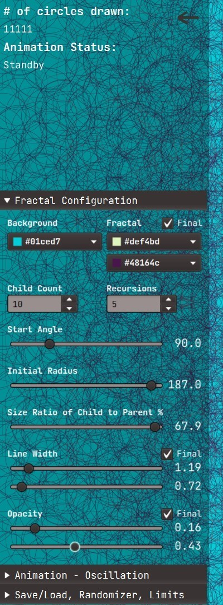

# FractalMatic
This app is a simple 2d fractal generator that uses JavaFx framework.
Fractalmatic has only one type of fractal at the moment, but the plan is to add more types in the future.

[Download stand-alone executable](#Download)

## Circles Fractal

The idea is super simple; the fractal starts with drawing the main/parent circle, then its evenly separated children - circles smaller than the parent circle- are drawn around the main/parent circle, and this process repeats for every child circle -the child becomes main it gets its children. Even though this process is very simple, the results are amazing. Here are some screenshots,

 
 
 

#### Configurations

As you see, each fractal is completely different from others, it's because you can change many parameters that will change the final result. You can see what parameters are available in the configuration menu screenshot below,

 

#### Animation

You can also animate some of these parameters, to be exact, everything below and including the start angle in the configuration menu.  Animation is basically an oscillation, and you can define amplitude and speed values. Animation performance depends on the system performance, and frame rate might drop significantly with large numbers of circles. You might want to limit the maximum number of circles for the animation to prevent FractalMatic from freezing.

 

 
 

#### Randomizer

Randomizer is a fun tool. You choose what to randomize and let the randomizer create a configuration for you, including animation. The keyboard shortcut is **CTRL + R**. Note that the randomizer generates a configuration within the specified number of circles range. If the number of circles is too high, it might take a second fractal to show up. You might limit the maximum limits based on your system performance in randomizer menu.

#### Save / Load

After creating interesting fractals by Randomizer or setting parameters manually, you can save the configurations you like and load them later.

#### Drag / Zoom

You also can drag the fractal around and zoom in. **Double-click** will reset the position and the zoom.

### Technical Details

Java version : 11.0.11
JavaFx version : 15.0.1
Build by using Maven

............................................................

### Download
To run FractalMatic, extract the zip, go to /bin folder and then, run the launch.bat file for Windows or launch.sh for Linux.

Windows might warn you about running the batch file, you need click "More options" on the warning dialog, then click "Run anyway". 

<a id="raw-url" href="https://github.com/zcagdasgurbuz/FractalMatic/blob/master/builds/win/fractalMatic.zip?raw=true">Download for Windows</a>

